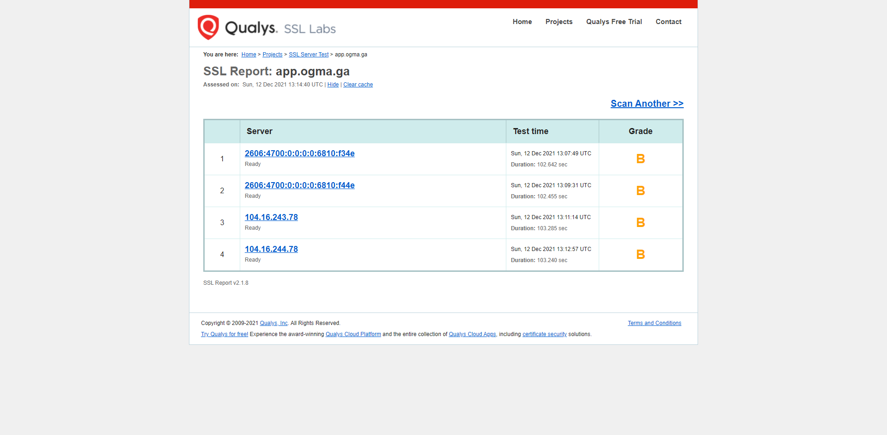
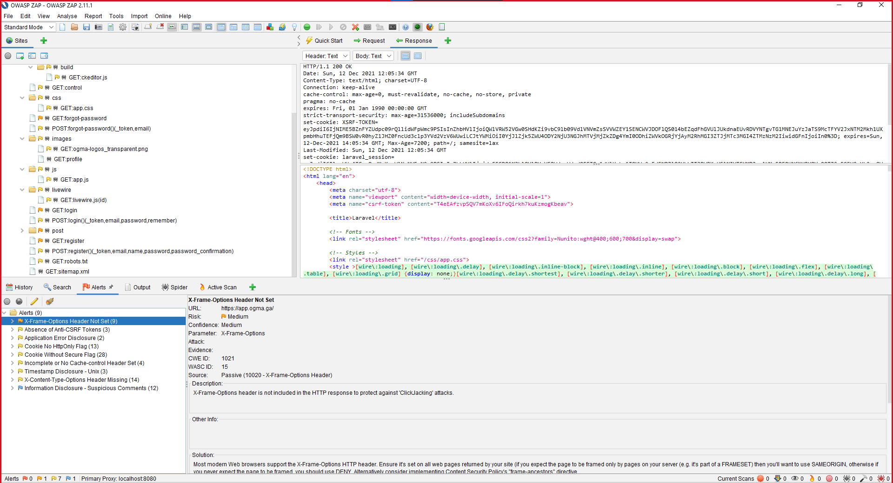

# Feedback door Guns for Hire

Aangezien dit feedback is bespreken we enkel de gevonden "problemen" en dus al de rest dat hier niet aangekaart wordt is dus geen probleem en hoort dus niet in de feedback te komen.

## Netwerken

Voor dit onderdeel hebben we SSL Labs gebruikt om de site te laten controleren. Ook hebben we op de HSTS proload list gekeken.

- B score bij SSL labs
  

- Er is geen DNS CAA record [zie afbeelding test](testing/ssl_labs_test.png)
- Je ondersteunt beter geen tls 1.0 en tls 1.1 [zie afbeelding test](testing/ssl_labs_test.png) + [source](https://blog.qualys.com/product-tech/2018/11/19/grade-change-for-tls-1-0-and-tls-1-1-protocols)
- Geen www endpoint aanwezig
- Staat niet op de hsts preload list

## DAST

Om dit te testen hebben we gebruik gemaakt van de ZAP OWASP tool en een scan gedaan van de website. Hieruit hebben we volgende "issues" terug gekregen.

- X-Frame-Options-Header niet aanwezig op elk endpoint (goed tegen ClickJacking attacks)
- Geen Anti-CSRF tokens aanwezig op GET https://app.ogma.ga/ , https://app.ogma.ga
- Zorg ervoor dat de HttpOnly flag gezet is voor elke cookie. zonder deze betekend dit dat de cookies te lezen zijn vanuit js
- Zorg ervoor dat de secure flag gezet is voor elke cookie met sensitieve informatie. Anders gaat deze langs een niet geencrypteerde kanaal gaan en kan de informatie dus gelezen worden als deze onderschpt wordt.
- Zorg er waar mogelijk voor dat de cache-control HTTP header is ingesteld met no-cache, no-store, must-revalidate. (login, register, forgot-password)
- Zorg ervoor dat de applicatie/webserver de Content-Type header juist instelt, en dat hij de X-Content-Type-Options header op 'nosniff' zet voor alle webpagina's.
- (X-Content-Type-Options header missing) Zorg ervoor dat de eindgebruiker een moderne webbrowser gebruikt die voldoet aan de normen en die in het geheel geen MIME-sniffing uitvoert, of die door de webtoepassing/webserver kan worden geïnstrueerd om geen MIME-sniffing uit te voeren.

## SCA

We hebben in de repo gekeken of er ergens sprake wes van een dependabot (de dependencie manager voor laravel/php projecten) maar hebben hier geen spoor van terug gevonden. Het han zijn dat deze wel geconfigureerd is maar gewoon nog niet actief.
Voorbeeld van een actieve dependabot:

- Door ons geen gebruik van dependabot teruggevonden.

## Acceptance criteria

Bronnen gebruikt: https://www.softwaretestinghelp.com/sql-injection-how-to-test-application-for-sql-injection-attacks/

- Een les verwijderen -> okay misschien prompten of dat de user zeker is.
- Comment maken werkt, maar verwijderen en berwerken niet.
- Een score geven aan een les -> niet gezien misschien op profiel. Maar hiertoe hebben we geen access omdat email verificatie niet werkt.
- Een les kan in de vorm van een post enkel met tekst en afbeeldingen of ook met een video. Afbeelding toevoegen lukte niet.
  
- Een administrator kan: lessen van alle gebruikers verwijderen gebruiker accounts verwijderen => geen admin credentials verkregen na vraag aan Wout Junius

### Usabilty aanbevelingen

- Email eerst verifiëren voor een post te kunnen aanmaken.
- Na registratie verwijzen naar home ipv een post maken.
- Post bijhouden indien er een fout is in de form en er geredirect wordt gelijk de titel anders kan iemand heel zijn les kwijt zijn.
- Melden van welke sites een video kan gebruikt worden.
- Comments naam en comment splitsen.
- Unix timestamp van post aanpassen naar lokaal.
- Email verificatie werkt niet / staat niet aan.
- Bulletpoints werken niet in texteditor bij "new post"
- Hoe werken de topics, wat zijn ze?
- (GDPR) melding van cookies toevoegen op site
