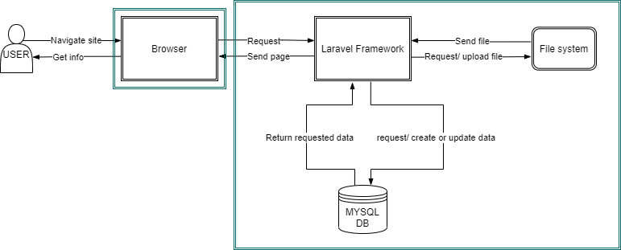

# Goal
Het doel van ons project is om kennis te delen door deze te verspreiden via de website. Dit gaan we doen op de volgende manier:

 - Gebruikers zullen hun eigen lessen kunnen posten en andere lessen kunnen volgen. Een les kan in de vorm van een post enkel met tekst en afbeeldingen of ook met een video.
 - Mensen die niet ingeschreven zijn kunnen de lessen zien maar kunnen daar niet op reageren en hun eigen lessen niet posten.
 - Vanaf het moment dat mensen kunnen leren door lessen te volgen van andere users, op lessen kunnen reageren en hun eigen lessen kunnen posten.

# Acceptance criteria

 - Gebruikers zullen hun eigen lessen kunnen posten en andere lessen kunnen volgen. Een les kan in de vorm van een post enkel met tekst en afbeeldingen of ook met een video. Een les kan je ook in de vorm van een thread hebben, wat zeer handig is voor mensen die een bepaald onderwerp willen leren vanaf 0. 
 - ~~De reactie/comment functionaliteit zal de studenten de mogelijkheid geven om vragen te stellen en die vragen kunnen door elk gebruiker die een account heeft beantwoord worden.~~ EDIT: Op een les kan je mensen taggen in een comment om een vraag te stellen.
 -
 - Mensen die niet ingeschreven zijn kunnen de lessen zien maar kunnen daar niet op reageren en hun eigen lessen niet posten.
 - gebruikers kunnen aan het einde van een les een quiz invullen

 - een geregistreerde gebruiker kan:  zich inschrijven & uitschrijven in een les
                                        een les aanmaken
                                        een les bewerken
                                        een les verwijderen
                                        een comment aanmaken, ~~bewerken~~ & verwijderen
                                        een score geven aan een les

- een niet geregistreerde gebruiker kan: een les lezen maar niks posten op de website

- een administrator kan: lessen van alle gebruikers verwijderen 
                         gebruiker accounts verwijderen
                        

# Threat model
*describe your threat model. One or more architectural diagram expected. Also a list of the principal threats and what you will do about them*

-	Injecties: Veilige APIs gebruiken, whitelist server-side input validation (voor speciale karakters) en LIMIT gebruiken voor SQL.

-	Vulnerable and Outdated Components: We gaan de bronnen van wat we gebruiken goed na checken en elke keer de stabielste en laatste versie proberen te gebruiken. Hiervoor maken we gebruik van de ingebouwde npm dependency check. Voor de website in productie gaat kijken we ook na of er libraries zijn die we niet gebruiken.

-	Broken access control : user account permissions controleren voordat ze aan data kunnen.

-	Security logging failures : encoded logging of login and all access control. De logs worden aangemaakt in een makkelijk leesbaar formaat waardoor problemen snel worden opgemerkt. Deze logs worden geëncrypteerd en opgeslagen op de server.

- Software and Data Integrity Failures: controleren of de software of gegevens afkomstig zijn van de verwachte bron en niet zijn gewijzigd.

- Cross site request forgery: Wanneer een gebruiker een geverifieerd verzoek indient door een formulier in te dienen, moet een willekeurig anti-CSRF-token in dat verzoek worden opgenomen. 

- Cryptographic Failures: We gaan alle gevoelige data encrypteren en gebruik maken van TLS, HSTS en SHA2.

- Identification and Authentication Failures: Accounts maken gebruik van extra sterke wachtwoorden met speciale karakters en een minimun lengte van 8 tekens.
- Alle accounts maken gebruik van 2 factor authentication bij inloggen.
- We maken gebruik van Laravel om een session ID aan te  maken.

- Voor de serverhosting maken we gebruik van Combell.
- Maken we gebruik van Paas of Saas? Paas.

- Om nieuwe kwetsbaarheden in onze code op Github te ontdekken maken we gebruik van Dependabot.

# Deployment
*minimally, this section contains a public URL of the app. A description of how your software is deployed is a bonus. Do you do this manually, or did you manage to automate? Have you taken into account the security of your deployment process?*
Public URL: https://app.ogma.ga/

# *you may want further sections*
*especially if the use of your application is not self-evident*
